# ERD — Basis Data FASTSAMBO

Skema: **`bilman`** pada PostgreSQL 15+ (Supabase).
Seluruh definisinya ada di [`supabase/migrations/`](../supabase/migrations/).

## Peta relasi

```mermaid
erDiagram
    UNIT ||--o{ PETUGAS : "mempekerjakan"
    UNIT ||--o{ PERIODE : "punya"
    UNIT ||--o{ PELANGGAN : "melayani"

    PERIODE ||--o{ SALDO_TUNGGAKAN : "menutup"
    PERIODE ||--o{ BEBAN_TAGIHAN : "menerbitkan"
    PERIODE ||--o{ SEGMEN_BEBAN : "membagi"
    PERIODE ||--o{ PENERTIBAN : "mencatat"
    PERIODE ||--o{ TARGET_PETUGAS : "menetapkan"
    PERIODE ||--o{ EFEKTIVITAS_PENAGIHAN : "mengukur"
    PERIODE ||--o{ PENGANTARAN_TUL601 : "menjadwalkan"
    PERIODE ||--o{ PEMBAYARAN : "menampung"
    PERIODE ||--o{ AKSI : "merencanakan"
    PERIODE ||--o{ KALENDER : "menyusun"

    PETUGAS ||--o{ SALDO_TUNGGAKAN : "meninggalkan"
    PETUGAS ||--o{ BEBAN_TAGIHAN : "memikul"
    PETUGAS ||--o{ PENERTIBAN : "melakukan"
    PETUGAS ||--o{ TARGET_PETUGAS : "dibebani"
    PETUGAS ||--o{ PELANGGAN : "menagih"
    PETUGAS ||--o{ PENGANTARAN_TUL601 : "mengantar"
    PETUGAS ||--o{ PEMBAYARAN : "menagihkan"
    PETUGAS ||--o| PROFIL : "diikat ke akun"

    PELANGGAN ||--o{ PENGANTARAN_TUL601 : "menerima"
    PELANGGAN ||--o{ PEMBAYARAN : "membayar"

    AKSI ||--o{ AKSI_LANGKAH : "dirinci jadi"

    UNIT {
        uuid id PK
        text kode UK
        text nama
        text up3
        text uid
    }
    PETUGAS {
        uuid id PK
        uuid unit_id FK
        text kode UK
        text nama
        enum status "AKTIF / TIDAK_AKTIF / PERLU_KONFIRMASI"
        date aktif_dari
        date aktif_sampai
    }
    PERIODE {
        uuid id PK
        uuid unit_id FK
        text kode UK "2026-09"
        smallint tahun
        smallint bulan
        enum status "REALISASI / BERJALAN / RENCANA"
        numeric target_saldo_akhir
    }
    SALDO_TUNGGAKAN {
        uuid id PK
        uuid periode_id FK
        uuid petugas_id FK
        int lembar_1
        numeric nilai_1
        int lembar_2
        numeric nilai_2
        int total_lembar "turunan"
        numeric total_nilai "turunan"
    }
    BEBAN_TAGIHAN {
        uuid id PK
        uuid periode_id FK
        uuid petugas_id FK
        int total_lembar
        numeric nilai_total
        int lembar_2
        numeric nilai_2
        int lembar_3
        numeric nilai_3
        int lembar_macet "turunan"
        numeric nilai_macet "turunan"
    }
    SEGMEN_BEBAN {
        uuid id PK
        uuid periode_id FK
        enum segmen "BILMAN / AMR / NA"
        int jumlah_lembar
        numeric nilai
    }
    PENERTIBAN {
        uuid id PK
        uuid periode_id FK
        uuid petugas_id FK
        int jumlah_pelanggan
        numeric nilai
        int jumlah_surat_peringatan
        int jumlah_lunas_setelah_peringatan
    }
    TARGET_PETUGAS {
        uuid id PK
        uuid periode_id FK
        uuid petugas_id FK
        numeric target_sisa
        numeric rst_target
    }
    EFEKTIVITAS_PENAGIHAN {
        uuid id PK
        uuid periode_id FK
        text segmen "LEMBAR_1 / LEMBAR_2"
        int posisi_awal
        int masih_menunggak
        int tertagih
    }
    PELANGGAN {
        uuid id PK
        uuid unit_id FK
        uuid petugas_id FK "NULL = lembar #N/A"
        text idpel UK
        text rbm
        float latitude
        float longitude
        bool termapping
    }
    PENGANTARAN_TUL601 {
        uuid id PK
        uuid periode_id FK
        uuid pelanggan_id FK
        uuid petugas_id FK
        smallint jml_lembar
        numeric nilai_tagihan
        enum prioritas
        text gelombang
        enum status_antar
        enum status_terima
        date tgl_antar
        text foto_fto_url "wajib bila TERANTAR"
        float jarak_validasi_m
    }
    PEMBAYARAN {
        uuid id PK
        uuid periode_id FK
        uuid pelanggan_id FK
        uuid petugas_id FK
        date tanggal_bayar
        numeric nilai
        bool setelah_peringatan
    }
    AKSI {
        uuid id PK
        uuid periode_id FK
        text kode UK
        text judul
        numeric dampak_nilai
        enum prioritas
        date tenggat
        enum status
    }
    AKSI_LANGKAH {
        uuid id PK
        uuid aksi_id FK
        smallint urutan
        text langkah
        bool selesai
    }
    KALENDER {
        uuid id PK
        uuid periode_id FK
        smallint urutan
        date tanggal_mulai
        date tanggal_selesai
        text kegiatan
    }
    PROFIL {
        uuid id PK "= auth.users.id"
        uuid petugas_id FK
        enum peran "ADMIN / MANAJER / SUPERVISOR / BILMAN / PENGAMAT"
    }
```



Tiga tabel referensi berdiri sendiri tanpa relasi karena isinya memang tidak
terikat periode maupun petugas: **`parameter`** (target dan ambang batas),
**`komponen_skor`** (bobot penilaian), **`hambatan`**, dan
**`catatan_perbaikan`**. Satu tabel lagi, **`audit_log`**, diisi otomatis oleh
pemicu dan tidak dirujuk siapa pun.

## Mengapa dibentuk seperti ini

| Keputusan | Alasan |
|---|---|
| `saldo_tunggakan` dan `beban_tagihan` dipisah | Keduanya menjawab pertanyaan berbeda: satu capaian, satu beban kerja. Menggabungkannya adalah persis kekeliruan yang membuat petugas berwilayah terluas terbaca paling buruk. |
| Kolom turunan (`total_nilai`, `nilai_macet`) disimpan `generated always` | Tidak mungkin melenceng dari komponennya, dan kueri dashboard tidak perlu menjumlah ulang tiap kali. |
| Ambang kategori RST ada di `parameter`, bukan di kode | Manajer unit dapat menggeser batas “Cukup” dan “Perlu Atensi” lewat satu baris `update`, tanpa migrasi baru. |
| Bobot penilaian ada di `komponen_skor` | Bobot menentukan cara orang dinilai, jadi ia data yang bisa diaudit — bukan angka yang terkubur di dalam rumus. |
| `pelanggan.petugas_id` boleh `NULL` | Justru itu definisi lembar #N/A: ada tagihannya, tidak ada yang menagihnya. Membuatnya wajib akan menyembunyikan masalah senilai Rp104,7 juta. |
| `pengantaran_tul601` punya `check` bukti FTO | Aturan “tanpa foto tidak dihitung terantar” ditegakkan basis data, bukan sekadar diingatkan aplikasi — supaya tidak bisa ditembus lewat jalur lain. |
| `audit_log` diisi pemicu `security definer` | Baris audit tidak dapat ditulis atau dihapus langsung oleh siapa pun, termasuk oleh yang perbuatannya sedang dicatat. |

## Lapisan analitik

View pada `supabase/migrations/20260913000001_views.sql` melakukan seluruh
perhitungan di basis data, sehingga aplikasi tidak pernah menghitung ulang
dengan rumus yang bisa menyimpang:

| View | Menjawab |
|---|---|
| `v_beban` | Berapa beban kerja tiap petugas, dan siapa yang paling berisiko |
| `v_saldo` | Berapa sisa tiap petugas, bagiannya terhadap unit, dan konsentrasi kumulatifnya |
| `v_rst` | Klasemen yang adil: sisa ÷ beban, berikut kategorinya |
| `v_pengantaran` | Tiap lembar TUL 6.01, lengkap dengan penanda bukti dan *suspect* |
| `v_progres_antar` | Progres antar per petugas dan ketepatan waktunya |
| `v_cash_in` | Cash-in dini dan efektivitas penertiban per petugas |
| `v_skor_kinerja` | Skor lima komponen berbobot, dinormalisasi atas komponen yang datanya ada |
| `v_target` | Target individual dibanding posisi awal |
| `v_kpi_unit` | Satu baris ringkasan eksekutif per periode |
| `v_efektivitas` | Konversi penagihan antar-lembar |

Seluruh view memakai `security_invoker = on`, sehingga Row Level Security
pemanggil tetap berlaku dan tidak bisa ditembus lewat view.

## Ekspos ke REST API

Supabase hanya mengekspos schema `public`. View pembungkus `public.fs_*`
membuat data terbaca lewat `supabase.from('fs_kpi_unit')` **tanpa** perlu
mengubah setelan *Exposed schemas*. Satu fungsi RPC tersedia untuk jalur tulis
lapangan:

```sql
select public.fs_catat_pengantaran(
  p_idpel         => '512345678901',
  p_periode       => '2026-09',
  p_status_terima => 'DITERIMA_LANGSUNG',
  p_foto_url      => 'https://…/fto.jpg',
  p_lat           => -1.0512,
  p_lon           => 116.9834
);
```

Fungsi ini menolak lembar tanpa foto, menghitung sendiri jarak titik foto ke
titik pelanggan termapping (haversine, tanpa perlu PostGIS), dan menandai
*suspect* bila melampaui ambang `jarak_validasi_maks`. Karena berjalan sebagai
`security invoker`, seorang bilman hanya bisa mencatat lembar di wilayah
kerjanya sendiri.
